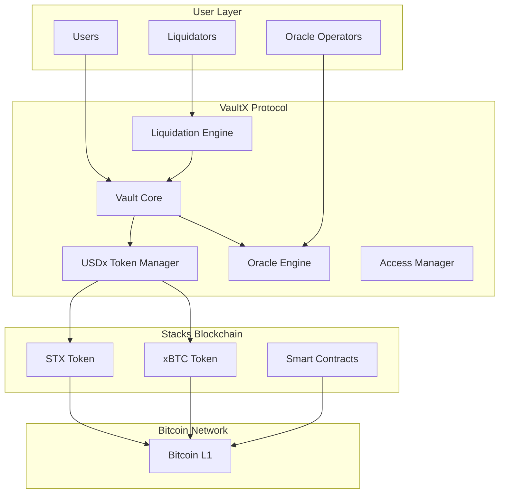

# VaultX Protocol

[](https://stacks.co/)
[](https://clarity-lang.org/)
[](https://bitcoin.org/)

> **Next-Generation Bitcoin-Backed Stablecoin Protocol**
>
> A sophisticated DeFi protocol enabling users to mint USDx stablecoins by depositing STX and xBTC as collateral, featuring automated liquidation mechanisms and oracle-based price feeds for maximum stability.

## 🎯 Overview

VaultX Protocol revolutionizes the Bitcoin DeFi ecosystem by providing a robust, multi-collateral Collateralized Debt Position (CDP) system. Built on Stacks Layer 2, VaultX enables users to unlock liquidity from their Bitcoin and STX holdings while maintaining exposure to the underlying assets.

### Key Features

- 🏦 **Multi-Asset Collateral Support** - Deposit STX and xBTC as collateral
- 🔮 **Oracle-Based Price Feeds** - Real-time asset pricing with staleness protection
- ⚡ **Automated Liquidation Engine** - Configurable thresholds and penalty mechanisms
- 🪙 **SIP-010 Compliant USDx Token** - Full fungible token standard implementation
- 📊 **Comprehensive Vault Management** - Create, manage, and monitor vault positions
- 🛡️ **Emergency Controls** - Protocol-level safety mechanisms
- 🔒 **Decentralized Governance** - No central points of failure

## 🏗️ Architecture

### System Overview



### Core Components

#### 1. Vault Management System

- **Vault Creation**: Multi-collateral vault initialization
- **Collateral Management**: Add/withdraw collateral with safety checks
- **Debt Management**: Mint/burn USDx tokens against collateral
- **Health Monitoring**: Real-time collateralization ratio tracking

#### 2. Oracle Engine

- **Price Feed Management**: Secure price data ingestion
- **Staleness Protection**: Time-based price validity checks
- **Confidence Scoring**: Price reliability assessment
- **Multi-Operator Support**: Decentralized price feed network

#### 3. Liquidation Engine

- **Health Factor Calculation**: Automated risk assessment
- **Liquidation Execution**: Penalty-based collateral liquidation
- **Liquidator Incentives**: Economic rewards for protocol maintenance
- **Emergency Safeguards**: Protocol-level protection mechanisms

#### 4. USDx Stablecoin

- **SIP-010 Compliance**: Full fungible token standard
- **Mint/Burn Mechanics**: Collateral-backed token issuance
- **Transfer Functions**: Standard token operations
- **Supply Management**: Dynamic supply based on collateral

## 🔧 Technical Specifications

### Protocol Parameters

| Parameter | Value | Description |
|-----------|-------|-------------|
| **Minimum Collateral Ratio** | 200% | Required overcollateralization for new vaults |
| **Liquidation Threshold** | 150% | Health factor triggering liquidation |
| **Liquidation Penalty** | 10% | Additional penalty for liquidated positions |
| **Stability Fee** | 2% APR | Annual fee on outstanding debt |
| **Max Price Age** | 1 hour | Maximum acceptable price feed staleness |

### Data Structures

#### Vault Structure

```clarity
{
    owner: principal,           ; Vault owner address
    stx-collateral: uint,      ; STX collateral amount
    xbtc-collateral: uint,     ; xBTC collateral amount  
    debt: uint,                ; Outstanding USDx debt
    last-update: uint,         ; Last modification block
    is-active: bool            ; Vault status flag
}
```

#### Price Feed Structure

```clarity
{
    price: uint,               ; Asset price in microunits
    timestamp: uint,           ; Price update block height
    confidence: uint           ; Confidence level (1-100)
}
```

## 🚀 Getting Started

### Prerequisites

- [Stacks CLI](https://docs.stacks.co/docs/write-smart-contracts/clarinet) installed
- [Clarinet](https://github.com/hirosystems/clarinet) for testing
- Basic understanding of Clarity smart contracts

### Installation

1. **Clone the repository**

   ```bash
   git clone https://github.com/emeka-favour/VaultX.git
   cd vaultx-core
   ```

2. **Install dependencies**

   ```bash
   clarinet install
   ```

3. **Run tests**

   ```bash
   clarinet test
   ```

4. **Deploy to testnet**

   ```bash
   clarinet deploy --testnet
   ```

### Quick Start Guide

#### 1. Create a Vault

```clarity
;; Create vault with 1000 STX and 0.1 xBTC
(contract-call? .vaultx-protocol create-vault u1000000000 u10000000)
```

#### 2. Mint USDx Tokens

```clarity
;; Mint 500 USDx against vault collateral
(contract-call? .vaultx-protocol mint-usdx u1 u500000000)
```

#### 3. Manage Collateral

```clarity
;; Add additional STX collateral
(contract-call? .vaultx-protocol add-collateral u1 u500000000 u0)
```

#### 4. Monitor Vault Health

```clarity
;; Check vault health factor
(contract-call? .vaultx-protocol calculate-health-factor u1)
```

## 📋 API Reference

### Core Functions

#### Vault Management

- `create-vault(stx-amount, xbtc-amount)` - Create new collateralized vault
- `add-collateral(vault-id, stx-amount, xbtc-amount)` - Add collateral to existing vault
- `withdraw-collateral(vault-id, stx-amount)` - Withdraw excess collateral
- `mint-usdx(vault-id, amount)` - Mint USDx tokens against collateral
- `burn-usdx(vault-id, amount)` - Burn USDx to reduce debt

#### Oracle Operations

- `update-price(asset, price, confidence)` - Update asset price feed
- `get-price(asset)` - Retrieve current asset price
- `set-oracle-operator(operator, authorized)` - Manage oracle permissions

#### Liquidation System

- `liquidate-vault(vault-id)` - Execute vault liquidation
- `calculate-health-factor(vault-id)` - Calculate vault health
- `set-liquidator(liquidator, authorized)` - Manage liquidator permissions

#### Read-Only Functions

- `get-vault(vault-id)` - Retrieve vault information
- `get-user-vaults(user)` - Get user's vault list
- `get-protocol-stats()` - Protocol statistics
- `is-vault-safe(vault-id)` - Check vault safety status

### USDx Token Functions (SIP-010)

- `transfer(amount, from, to, memo)` - Transfer tokens
- `get-balance(who)` - Get token balance
- `get-total-supply()` - Get total token supply
- `get-name()` - Get token name
- `get-symbol()` - Get token symbol
- `get-decimals()` - Get token decimals

## 🛡️ Security

### Security Measures

1. **Access Control**
   - Role-based permissions system
   - Owner-only administrative functions
   - Authorized liquidator network

2. **Input Validation**
   - Comprehensive parameter validation
   - Overflow/underflow protection
   - Range checking for all inputs

3. **Oracle Security**
   - Price staleness checks
   - Confidence level validation
   - Multi-operator redundancy

4. **Economic Security**
   - Overcollateralization requirements
   - Liquidation incentives
   - Emergency shutdown mechanisms

### Audit Status

- [ ] **Internal Security Review** - In Progress
- [ ] **External Security Audit** - Planned Q2 2024
- [ ] **Bug Bounty Program** - Post-Audit Launch

## 🤝 Contributing

We welcome contributions from the community! Please see our [Contributing Guidelines](CONTRIBUTING.md) for details.

### Development Process

1. **Fork** the repository
2. **Create** a feature branch (`git checkout -b feature/amazing-feature`)
3. **Commit** your changes (`git commit -m 'Add amazing feature'`)
4. **Push** to the branch (`git push origin feature/amazing-feature`)
5. **Open** a Pull Request

### Code Standards

- Follow [Clarity Style Guide](https://clarity-lang.org/style-guide)
- Include comprehensive tests for new features
- Document all public functions
- Maintain backwards compatibility

## 📊 Economics

### Tokenomics

- **USDx Supply**: Dynamically adjusted based on collateral
- **Collateral Types**: STX (primary), xBTC (secondary)
- **Stability Mechanism**: Overcollateralization + liquidations
- **Fee Structure**: 2% annual stability fee

### Risk Parameters

| Collateral | LTV Ratio | Liquidation Threshold | Penalty |
|------------|-----------|----------------------|---------|
| **STX** | 50% | 66.7% | 10% |
| **xBTC** | 50% | 66.7% | 10% |

## 🗺️ Roadmap

### Phase 1: Core Protocol
- [x] Basic vault functionality
- [x] USDx token implementation
- [x] Oracle integration
- [x] Liquidation engine

### Phase 2: Advanced Features

- [ ] Multi-collateral support expansion
- [ ] Advanced liquidation strategies
- [ ] Governance token launch
- [ ] Web interface deployment

### Phase 3: Ecosystem Integration

- [ ] DEX integrations
- [ ] Yield farming opportunities
- [ ] Cross-chain bridge development
- [ ] Mobile app launch

### Phase 4: Scale & Optimize

- [ ] Layer 2 optimizations
- [ ] Advanced risk management
- [ ] Institutional features
- [ ] Global expansion
